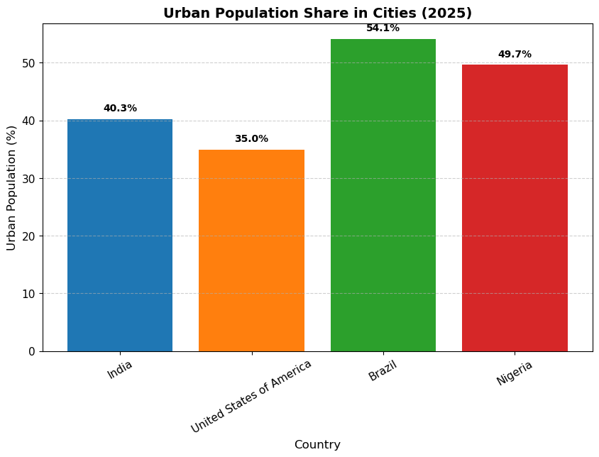

# SCT_DS_1 - SkillCraft Internship

## Task 01: Urbanization Visualization

**Objective:**  
Create a bar chart or histogram to visualize the distribution of a categorical/continuous variable.

**Dataset:**  
United Nations World Urbanization Prospects (2025 Revision)

**Notebook:**  
[`Task01.ipynb`](notebooks/Task01.ipynb)

**Visualization:**  
Bar chart showing urban population share in cities for India, USA, Brazil, and Nigeria (2025).

**Insights:**
- Brazil has the highest urban population share among the selected countries (~54%).
- Nigeria follows closely (~50%), highlighting rapid urban growth in Africa.
- India’s urbanization (~40%) is lower compared to peers, reflecting ongoing rural‑to‑urban transition.
- USA (~35%) appears lower in this dataset snapshot, emphasizing differences in classification methods.

**Chart Preview:**  

